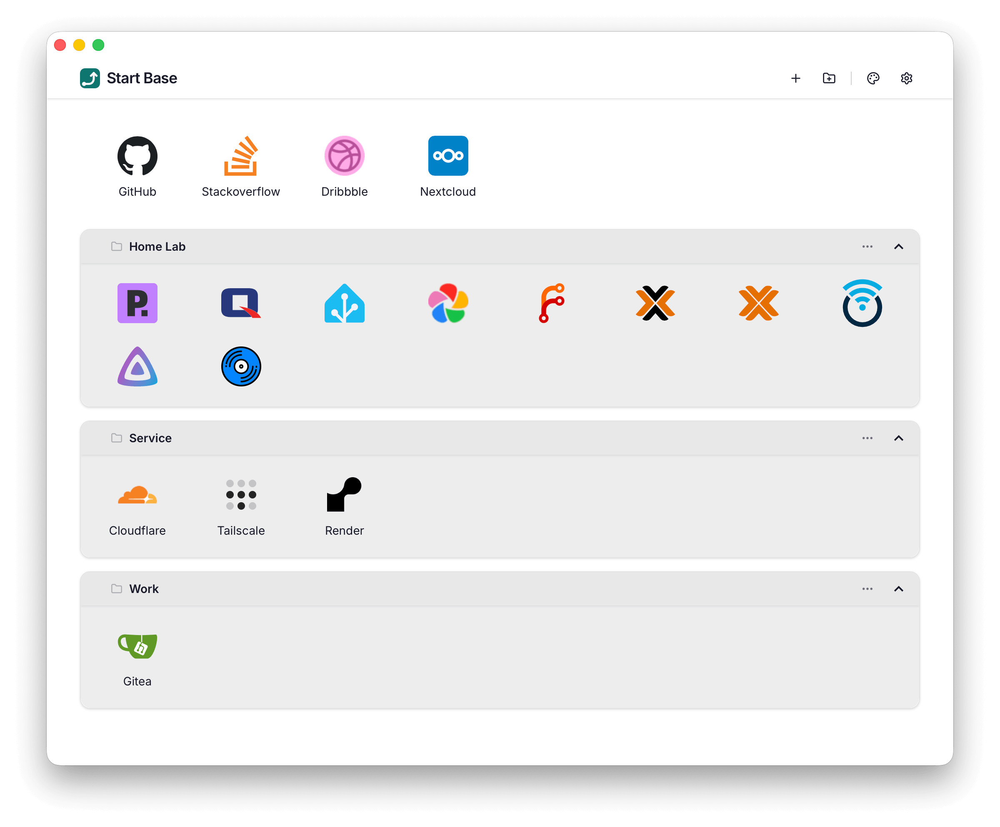
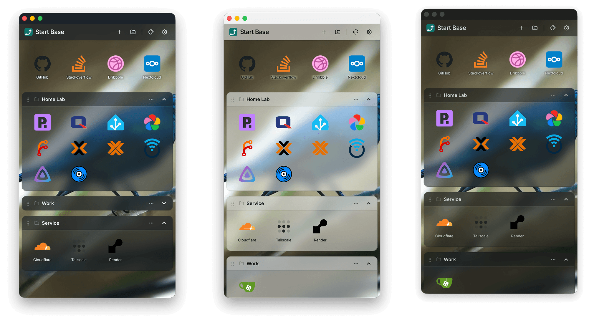

# Start Base

Lightweight dashboard to quickly access your websites.



## Demo Site

https://startbase-demo.onrender.com

Screencast: https://www.youtube.com/watch?v=5lDdiElmCYU

## Features

- ✨ **Intuitive UI** — Manage all settings and sites directly in the UI without editing configuration files
- 📌 **Grouped Sites** — Organize sites into custom groups
- ⚡ **Drag & Drop** — Reorder sites and groups, long-press to drag sites
- 🖼️ **Auto Metadata** — Automatically fetch page titles and favicons
- 📱 **Responsive Design** — Works seamlessly on desktop and mobile
- 🧩 **Extensible** — Use the [plugin system](./docs/plugin.md) to add more functionality

## Quick Start

```bash
docker run -p 5600:5600 -v "$(pwd)/data:/app/data" harryxu/startbase:latest
```

## Themes

Upload your favorite background image.


